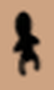
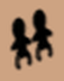
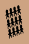
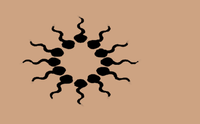
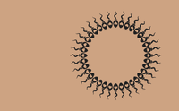
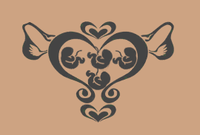

# Tattoos (SlaveTats)

If SlaveTats is installed, three optional tattoo features are available (enable in MCM under Children). The tattoo packs themselves -- **BabyTracker** for the first two and **BF Womb tattoo** for the womb state -- are an optional component in the FOMOD installer (the **SlaveTats Tattoo Packs** step, shown and pre-selected only when `SlaveTats.esp` is active). Re-run the installer and tick it if you skipped it.

!!! note "Register the packs in SlaveTats"
    After installing the tattoo packs, **classic SlaveTats** has to register them before Beeing Female can apply them. Open the SlaveTats MCM once so it re-scans its JSON definitions and picks up the **BF Womb** and **BabyTracker** packs -- if the overlays never appear, this is almost always why. **SlaveTats NG** registers new packs automatically, so you can skip this step.

## Baby Tracker Tattoos

Shows tally marks for total babies born. Uses denominations (1, 2, 3, 4, 8, 12) to compose the count. Updates after each birth and when toggling the MCM option.

| 1 | 2 | 3 | 4 | 8 | 12 |
|:--:|:--:|:--:|:--:|:--:|:--:|
|  |  |  |  |  |  |

## Semen Circle Tattoo

Shows a circle tattoo when viable sperm is present. Two variants:

- **Regular circle** -- sperm is inside but not during fertile window
- **Hearts circle** -- sperm is inside during ovulation (conception possible)

The tattoo automatically clears when all sperm expires or is washed out.

| Regular circle | Hearts circle |
|:--:|:--:|
| { width="170" } | { width="170" } |

## Womb State Tattoo

A single womb-diagram tattoo that mirrors the full reproductive state and updates as it changes:

- **Baseline / Ovulation** -- empty womb, with the ovulation variant during the fertile window
- **Semen fill levels** -- the womb fills as more sperm accumulates (separate art for normal and ovulation phases)
- **Fertilization** -- shown for the first day after conception
- **Pregnancy phases 1-3** -- one image per trimester; from the second trimester, twins/triplets/quadruplets get their own art
- **Birth** -- during labor, then back to baseline after recovery

| Baseline | Ovulation | Semen fill |
|:--:|:--:|:--:|
| { width="150" } | { width="150" } | { width="150" } |
| **Fertilization** | **Pregnancy 1** | **Pregnancy 2** |
| { width="150" } | { width="150" } | { width="150" } |
| **Pregnancy 3** | **Twins** | **Triplets** |
| { width="150" } | { width="150" } | { width="150" } |
| **Quadruplets** | **Birth** | |
| { width="150" } | { width="150" } | |

Exactly one tattoo from the set is shown at a time, and it updates on every cycle tick. **Player only by default.** Because it re-applies on every cycle/semen change, broadcasting it to tracked NPCs is expensive (and the belly overlay is rarely visible on clothed actors), so it is gated behind an INI opt-in: set `Global_WombTattooNPCs=true` in `Default Global Settings.ini` (and enable that add-on) to extend it to tracked female NPCs. If you later turn the option off, press **Refresh Tattoos** (MCM → Children) once to strip the womb overlay back off any NPCs that still have it.

## Removing the Tattoos

Turn the corresponding toggle(s) off in **MCM → Children** -- the overlay is stripped from the player immediately. If one lingers anyway, or **keeps coming back after loading a save**, press **Refresh Tattoos** once with the toggles off: the button re-syncs everything in both directions, re-applying enabled families and force-removing every tattoo Beeing Female has ever applied for disabled ones (including stale leftovers the normal toggle-off can miss).

!!! warning "Don't remove SlaveTats overlays with RaceMenu"
    RaceMenu only clears the visible body overlay -- SlaveTats still has the tattoo in its own registry and will faithfully paint it back on the next game load. That is not Beeing Female re-applying it. Always remove tattoos via the Beeing Female MCM toggles (plus **Refresh Tattoos**) or the SlaveTats MCM, so the registry entry itself is removed.
